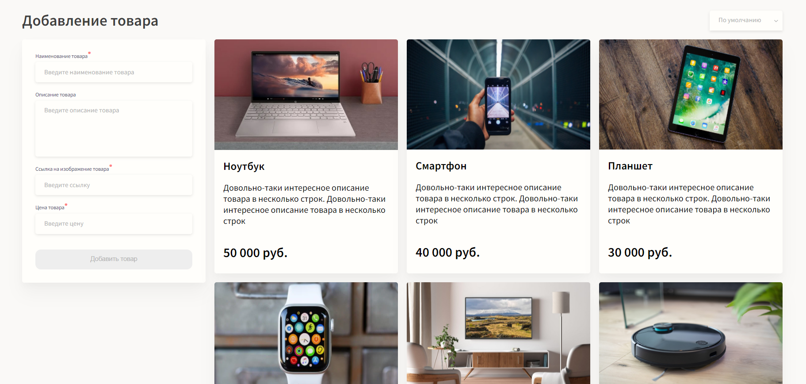
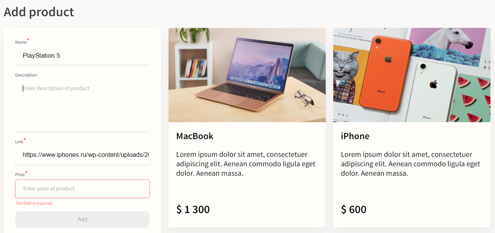
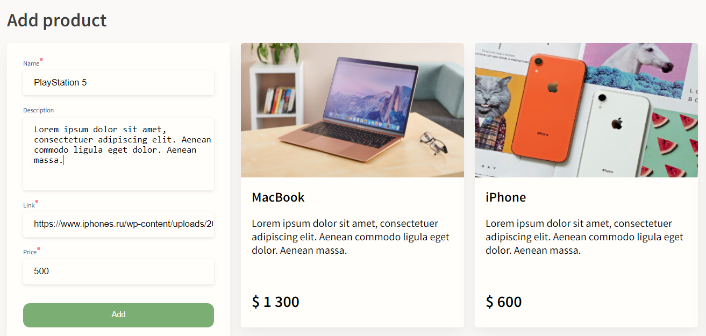

# nuxt-app
## Форма Vue.js с валидацией, возможностью добавлять/удалять и сортировать товары по нескольким категориям. Сохранение списка добавленных товаров при перезагрузке страницы.

## Сортировка

## Валидация формы

# Успешная валидация

## install dependencies
$ npm install

## serve with hot reload at localhost:3000
$ npm run dev

## build for production and launch server
$ npm run build
$ npm run start

## generate static project
$ npm run generate

